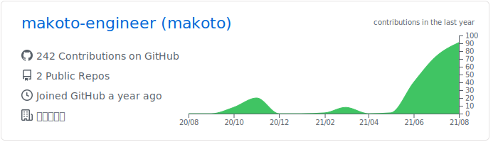
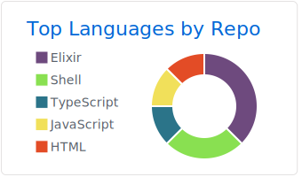
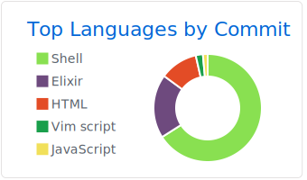
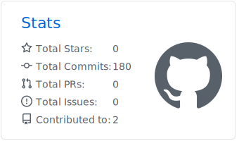

## Hello guys!

I'm a freelance web development engineer, and loves making things!

I am actively keeping up with new programming languages and new technologies.

And, I am passionate about functional programming, and am trying to learn configurations and techniques that combine performance and maintainability.

## Status

## Languages and Tools

### Frontend

 
   
   
   
   
   
   

### Backend

 
  
   
  
  
   
  

### Cloud

 
   
   
  
   

### Altjs

 
   
  
   
  
  
   
   
  

### Mobile

  
  

### Static site builder

 
   
   

