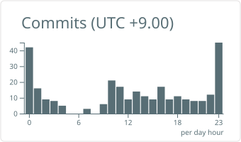
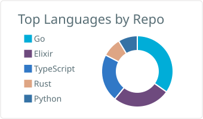
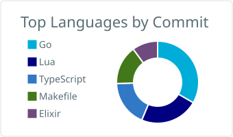

# makoto-developer

## About / 自己紹介

I have worked as a developer in the IT industry for over 10 years.

My experience spans infrastructure (both on-premises and cloud), mobile, and web applications. I currently work as an architect and tech lead.

---

わたしは10年以上にわたりIT業界で開発者として活動しています。

インフラ（オンプレ・クラウド共に）、モバイル、Webアプリと幅広く経験し、現在はアーキテクトやテックリードとして活動しています。

## Portfolio / ポートフォリオ

- **[Strata](https://github.com/makoto-developer/strata)** ([site](https://makoto-developer.github.io/strata/)) 
  Dependency & call-graph visualizer for microservices. Traces gRPC / REST / GraphQL to the function level and checks layering in CI. 
  マイクロサービスの依存関係・コールグラフ可視化ツール。gRPC / REST / GraphQL を横断して関数レベルで追跡し、循環依存とレイヤー違反を CI で検査。
- **[実践IT英会話](https://learning-english.app.makoto-developer.net/)** 
  English learning app for engineers, focused on the vocabulary that comes up in real development work. 
  エンジニア向けのIT英会話学習アプリ。開発の現場で実際に使う英語に絞って練習できる。

More / その他: [テックブログのポートフォリオ](https://blog.makoto-developer.net/portfolio)

## Recent stats / 最近のステータス

  
  

  

## Programming languages / プログラミング言語

JavaScript
/ TypeScript
/ Next.js
/ Go
/ gRPC
/ Elixir
/ Erlang
/ GraphQL
/ Rust
/ tRPC
/ Lisp(Common Lisp)
/ F#

## Mobile / Desktop / モバイル・PC

Flutter
/ Swift
/ React Native
/ Tauri(Rust)
/ ElixirDesktop(Elixir)
/ LiveViewNative(Elixir)

## Infrastructure / インフラ関連

AWS
/ Google Cloud
/ Firebase
/ Kubernetes
/ Argo CD
/ Terraform
/ helm
/ OpenStack
/ Vercel
/ Heroku
/ Cloudflare
/ PlanetScale
/ PostgreSQL
/ MySQL
/ Dgraph
/ Algolia
/ Realm
/ FoundationDB
/ SurrealDB
/ RabbitMQ
/ Kafka

## Gist

[makoto-developer's Gist Page](https://gist.github.com/makoto-developer)
